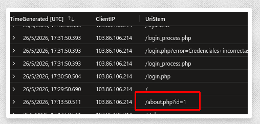
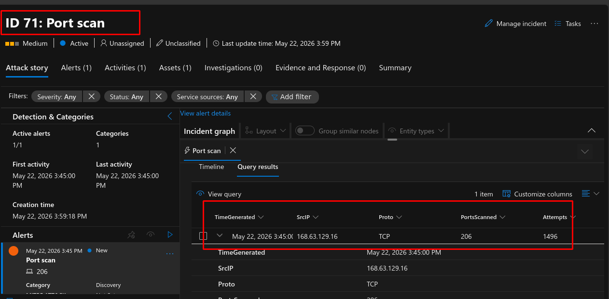
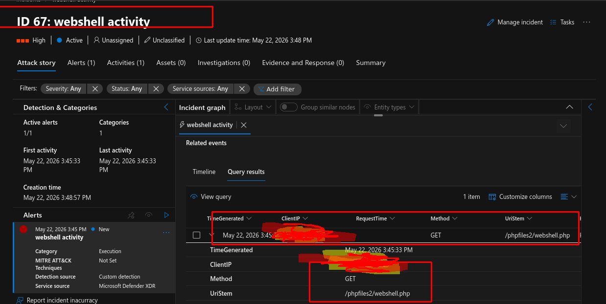

# Azure Infrastructure Lab — AZ-104 Study Project

A hands-on Azure infrastructure lab built to develop practical skills and prepare for the **AZ-104: Microsoft Azure Administrator** certification exam. All resources were deployed to Azure East US using ARM templates and Azure CLI scripts, covering every major exam domain through real-world implementation. Includes a PHP web application deployed on the web tier with secure coding practices throughout.

---

## Quick Reference

| Property | Value |
|---|---|
| Resource Group | `virtualmachines-rg` |
| Region | East US |
| Deployment Method | ARM Templates + Azure CLI Bash Script |
| Virtual Network | `example-vnet` — 10.0.0.0/16 |
| VMs Deployed | 3 (vm-web, vm-db, vm-w11) |
| Monitoring | Log Analytics Workspace + DCR + Azure Monitor Agent |
| SIEM | Microsoft Sentinel with custom KQL alert rules |
| Web Application | PHP — swagmasaoweb (security-hardened) |

---

## Architecture

The environment follows a **three-tier network design** with each tier isolated in its own subnet, protected by a dedicated Network Security Group. Traffic between tiers is explicitly controlled and least-privilege by design.

### Virtual Network Layout

| Subnet | CIDR | Role | VM Hosted |
|---|---|---|---|
| subnet1 | 10.0.1.0/24 | Web tier | vm-web — Debian 12, Standard_B1ms |
| subnet2 | 10.0.2.0/24 | Database tier | vm-db — Debian 12, Standard_B1ms |
| subnet3 | 10.0.3.0/24 | Workstation tier | vm-w11 — Windows 11 Pro, Standard_B2s |

### Network Security Group Rules

| NSG | Rule Name | Direction | Source | Dest. Port | Action |
|---|---|---|---|---|---|
| nsg-subnet1 | Allow-HTTP-From-10.0.3.0/24 | Inbound | 10.0.3.0/24 | 80 | Allow |
| nsg-subnet1 | AllowME | Inbound | Admin IP | All | Allow |
| nsg-subnet2 | AllowFromWSSubnet | Inbound | 10.0.1.0/24 | 1433 | Allow |
| nsg-subnet2 | AllowME | Inbound | Admin IP | All | Allow |
| nsg-subnet3 | AllowME | Inbound | Admin IP | All | Allow |

All subnets rely on Azure's implicit default deny for any traffic not explicitly permitted above.

---

## Deployment

Deployment was fully automated using a multi-step Bash script orchestrating ARM template deployments and Azure CLI commands in sequence.

1. Resource Group creation in East US
2. Networking: VNet, subnets, and NSGs via ARM template
3. VMs: three VMs with NICs via ARM template
4. Public IP assignment: Standard SKU static IPs attached to each NIC
5. Log Analytics Workspace creation (`lgvms1`, PerGB2018, 30-day retention)
6. Data Collection Rule creation (`dcr-vms`) targeting the workspace
7. Azure Monitor Agent installation on each VM + DCR association

### Public IP Configuration

| VM | NIC | Public IP Name | SKU | Allocation |
|---|---|---|---|---|
| vm-web | nic-web | public-ip-vm-web | Standard | Static |
| vm-db | nic-db | public-ip-vm-db | Standard | Static |
| vm-w11 | nic-w11 | public-ip-vm-w11 | Standard | Static |

---

## Monitoring & Observability

### Log Analytics Workspace

| Setting | Value |
|---|---|
| Workspace Name | lgvms1 |
| SKU | PerGB2018 (pay-as-you-go) |
| Retention | 30 days |
| Location | East US |

### Data Collection Rule — `dcr-vms`

- Data source: Performance counters (`Microsoft-Perf` stream)
- Counter: `\Processor(_Total)\% Processor Time`
- Sampling frequency: every 60 seconds
- Destination: `lgvms1` Log Analytics workspace
- Agent: Azure Monitor Agent (AMA) installed on all three VMs
- DCR associated to each VM resource ID individually

---

## Security — Microsoft Sentinel

Microsoft Sentinel was enabled on the Log Analytics workspace to provide SIEM/SOAR capabilities. Custom KQL-based analytics rules detect threats across all phases of the attack lifecycle, aligned with the **MITRE ATT&CK** framework.

### Alert Rules by Attack Phase

**Reconnaissance**
- Port scan detection — flags source IPs attempting more than 15 distinct destination ports within 1 minute

**Initial Access**
- SSH brute force — more than 5 failed password attempts in 2 minutes (Syslog)
- RDP brute force — more than 5 EventID 4625 logon failures in 2 minutes (SecurityEvent)
- Successful login after prior failures — correlates accepted logins against a failure baseline

**Post-Exploitation**
- Reverse shell indicator — outbound connections from VMs on non-standard ports
- Base64 encoded command execution — regex match on Syslog for encoded payloads
- Suspicious process spawned from web service — `nc`, `wget`, `curl` launched by nginx/apache/www-data
- New local user created — `useradd` or "new user" events on Linux VMs
- Privilege escalation — `sudo` usage outside expected maintenance commands
- Windows Event Log cleared — EventID 1102 / 104
- Scheduled task created — EventID 4698 on vm-w11

**Azure Control Plane**
- NSG rule modified — AzureActivity log, `networkSecurityGroups/securityRules` operations
- RBAC role assignment changed — AzureActivity log, `roleAssignments` write operations
- Public IP attached to NIC — AzureActivity log, `publicIPAddresses` write operations

---

## Additional Azure Services Configured

| Service / Domain | What Was Configured |
|---|---|
| Identity & Governance | Azure AD users, groups, RBAC role assignments at resource group scope, Azure Policy |
| Storage | Storage account, blob containers with access tiers (hot/cool/archive), SAS tokens, lifecycle management policies, Azure File shares |
| Azure Backup | Recovery Services Vault, VM backup policies, restore operations on vm-db |
| Hybrid Connectivity | Site-to-site VPN between Azure VNet and AWS VPC |
| App Service | App Service Plan and Web App deployment, scaling rules, deployment slots, VNet integration |
| Azure DNS | Public and private DNS zones, record types, name resolution between VNets |

---

## AZ-104 Exam Domains Coverage

| Exam Domain | Coverage |
|---|---|
| Manage Azure identities and governance | Users, groups, RBAC, Azure Policy |
| Implement and manage storage | Blob, Files, SAS, lifecycle, access tiers |
| Deploy and manage Azure compute resources | VMs, NICs, disks, VM extensions, ARM templates |
| Implement and manage virtual networking | VNet, subnets, NSGs, public IPs, DNS, VPN Gateway |
| Monitor and maintain Azure resources | Log Analytics, DCR, AMA, Azure Monitor, Sentinel, Backup |

---

## Security Validation — Penetration Test

A controlled penetration test was conducted against the three public-facing VMs to validate Sentinel detection rules and identify coverage gaps.

**Rules of Engagement**
- Scope: three public IPs only — vm-web, vm-db, vm-w11
- Out of bounds: Azure portal access, personal accounts, social engineering
- Agreed start/end time window for clean Sentinel log analysis
- Tester maintained a timestamped action log for gap analysis
- No cleanup during the test — logs preserved for post-engagement review

**Gap Analysis Methodology:** Tester actions were compared against Sentinel alerts fired during the engagement window. Any action that did not generate a corresponding alert was logged as a detection gap and used to add or tune a KQL rule, directly improving detection coverage across all alert categories.

---

## Web Application — swagmasaoweb

A PHP web application deployed on vm-web with session-based authentication, MySQL for data storage, and a shared template system.

| Property | Value |
|---|---|
| Language | PHP |
| Database | MySQL via MySQLi extension |
| Authentication | PHP session-based (`$_SESSION`) |
| Database name | swagmasaoweb |
| Pages | Portada (index), Sobre Masao, Contacto, Login, Logout |
| Template system | `openHTML()` / `closeHTML()` in `template.php` |

### File Structure

```
swagmasaoweb/
├── template.php     # Shared HTML wrapper, session handling, DB queries, nav rendering
├── index.php        # Homepage
├── login.php        # Credential validation and session creation
├── logout.php       # Session destruction and redirect
├── about.php        # About page
├── contact.php      # Contact page
└── styles.css       # Global stylesheet
```

### Secure Coding Practices

**1. Prepared Statements — SQL Injection Prevention**  
All database queries use `mysqli_prepare()` with bound parameters. The session user ID is also cast to `(int)` as a defence-in-depth measure before being passed to any query.

**2. Output Encoding — XSS Prevention**  
All database-sourced values displayed in HTML are passed through `htmlspecialchars($value, ENT_QUOTES, "UTF-8")` before output, preventing any stored markup from being interpreted by the browser.

**3. Server-Side Error Handling — Information Disclosure Prevention**  
Database connection errors are written to the server log via `error_log()` and never exposed to the user — raw MySQLi error strings contain table/column names that would aid an attacker.

**4. Correct `session_start()` Placement**  
`session_start()` is called at the very top of `template.php` before any HTML output, ensuring the session cookie header is always sent correctly.

**5. Admin Status Never Stored in Session**  
Admin status is re-queried from the `user_admins` table on every request rather than stored in `$_SESSION`, preventing privilege escalation by session tampering.

---

## Further Security Recommendations

| Recommendation | Why | Priority |
|---|---|---|
| Move DB credentials to a config file outside webroot | Credentials in source get exposed via version control or file read exploits | HIGH |
| Add CSRF tokens to all forms | Prevents cross-site request forgery on login and contact forms | HIGH |
| Use `password_hash()` / `password_verify()` | Ensures passwords are stored as bcrypt hashes, never plaintext or MD5 | HIGH |
| Set session cookie flags: `HttpOnly`, `Secure`, `SameSite=Strict` | Prevents session hijacking via XSS and cross-site requests | HIGH |
| Regenerate session ID on login: `session_regenerate_id(true)` | Prevents session fixation attacks | MEDIUM |
| Add `Content-Security-Policy` HTTP header | Restricts script sources, reduces XSS impact | MEDIUM |
| Rate-limit login attempts | Slows brute force attacks on the login form | MEDIUM |
| Log failed logins server-side | Enables Sentinel alerting on web-layer credential attacks | LOW |

---

*Built for AZ-104 exam preparation — Azure East US · Resource Group: `virtualmachines-rg`*

---

pics:










